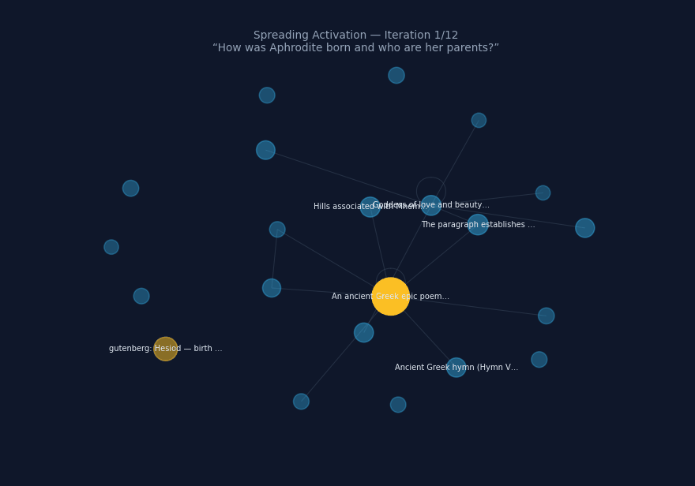

# Theogony

[](https://github.com/theogony-project/theogony/actions/workflows/ci.yml)
[](LICENSE)
[](https://www.python.org/downloads/)
[](ROADMAP.md)

**Theogony is building the knowledge layer beneath AI — as an open commons, owned by no one.**

Today's AI reads knowledge as text, re-parsed from scratch on every query. Theogony stores it the way a mind does — as **vectors and weighted edges that an AI *activates* instead of reads**. It is a **language model turned inside out**: the knowledge a transformer hides in frozen weights, made explicit, inspectable, and editable.

**Why it matters.** If every future AI depends on a knowledge layer, then whoever owns that layer shapes AI's relationship with truth. Theogony exists so that layer is **open, inspectable, and governed in the service of humanity** — not the proprietary, opaque asset of a single company.

The rest of this page is the full argument, in order — **the goal · what makes the mesh · the dimensions · the technique · the consequences for humanity · why it is necessary · where it leads · how we build it together** — with an honest status of what is and isn't proven at the end.

<p align="center">
  
</p>

<p align="center"><sub><em>Spreading Activation over the <strong>founding mesh</strong>: one query, propagating hop by hop through typed, weighted edges. A real constellation from the Greek-myth corpus that Kadmos read end to end (~460 concepts / ~28k edges) — early research, not a benchmark. The honest status is at the bottom of this page.</em></sub></p>

---

## 1 · The goal

Theogony builds the **Chronik**: today's working implementation of a long-horizon **Pantheon** — the planetary knowledge substrate beneath AI. Not a better search engine, not a bigger database, not another assistant. The **rail layer** beneath the models.

Foundation models are *vehicles* — they improve, split, and age out. The substrate of meaning they run on is the *rail*. Whoever shapes that rail shapes how intelligence relates to reality; the goal is that it stays **a commons in the service of humanity** — open, inspectable, owned by no one.

It is built to be **decentralization-capable and federated** (one instance or many; institutions and individuals keep sovereign sub-meshes joined to the commons through shared bridge concepts), **always democratic** (governed in the open, stewarded by a foundation rather than a market, with contradiction kept first-class so no single voice can flatten the rest), and **self-improving** — first its knowledge, then its own architecture, ultimately the stack it runs on.

> **The one thing never to lose sight of.** Whatever sub-problem you are deep in — human or AI agent — it is in service of *this*: an open, decentralized, democratically governed knowledge layer for the age of AI, a World-Brain that belongs to everyone and to no one.

## 2 · What makes the mesh

Knowledge is stored in the **native language of the minds that will use it**: vectors and weighted edges, not prose. Source text enters once, at the boundary, where **Kadmos** translates it into a dense mesh of embedding vectors and typed, weighted edges. After that, retrieval never re-reads strings.

**Agents do not read the Chronik — they activate it.** A query arrives as a vector. **Spreading Activation** propagates through the typed, weighted edge network — run as sparse matrix–vector multiplication over a vector-edge tensor — and returns a **constellation**: an activated subgraph of meaning, in the same representational space the model already computes in.

This is why the Chronik is **more than a database — it is a language model turned inside out**. A transformer keeps its knowledge implicit in frozen weights; the Chronik makes those weights **explicit, persistent, inspectable, and editable** — nodes, weighted edges, and a graph-activation forward pass.

The substrate is alive in the way a mind is:

- **Two tiers of nodes** — Observation Chunks (one extracted observation each) and Consolidated Nodes (entities, concepts, bridges, source-anchors). Identity is **eager** when the evidence is clear (Q-ID, description, or strong structural context), **emergent** otherwise.
- **Lifelike dynamics** — Hebbian strengthening, super-linear decay, bounded saturation, atrophy decoupled from deletion, homeostatic renormalisation.
- **A post-hoc immune system** — deduplication, contradiction resolution, false-information removal operate on existing state, by sample, in parallel. **No pre-gate ever judges content at insertion.**
- **The permanent dream (Oneiros)** — a continuous low-priority process that runs activation across existing knowledge, treats the resulting constellations as new observations, and writes back denser connections. The Chronik grows wiser without reading new text.

And it is consumed by a **Mesh-Native Language Model (MNLM)**: the cognitive primitive that does not *read* the mesh but **thinks inside it** — vector subgraphs in, vector subgraphs out, sharing recurrent state with the substrate. **The MNLM is a non-negotiable core concept** — it is the line between a knowledge *base* and a knowledge substrate that *computes*. *How* it is built is a replaceable proposal.

## 3 · The dimensions

The scale this aims at is civilizational, not application-sized — and it gets there by storing meaning, not instances.

- **Redundancy collapse.** Text systems store knowledge *instances* — the same law in a hundred articles, a thousand papers, a million pages. The Chronik stores it **once**: a second encounter with a concept does not create a second node, it adds edges. Node count grows with the number of *distinct concepts* in the world — roughly **1–5 billion**, bounded — while the trillions of sentences written about them become **edge density**.
- **The biological reference point.** The human cortex has ~16 billion neurons at ~7,000 synapses each. The intelligence is in the edges, not the nodes. Redundancy in source text becomes connectivity in the substrate — so more sources make the Chronik *wiser*, not merely larger.
- **A federated substrate.** A **global public layer** (open corpora, contradiction-tracked, provenance-anchored), thousands of **institutional sub-meshes**, and billions of **personal sub-meshes** — joined through **bridge nodes** (shared public concepts). Spreading Activation flows through bridges subject to the querying agent's permissions. The full federation may have *fewer* unique concept nodes than expected, but an edge density approaching and eventually exceeding the synaptic reference point.

## 4 · The technique

The vision is fixed; **this implementation is an explicitly replaceable proposal**. What does not bend is the architectural floor:

- **No raw text as the retrieval payload.** Text is reserved for the system's edges (a node's description, an edge's relation descriptor, a source-anchor URL), never for the retrieval primitive.
- **LanceDB + PyTorch.** Append-only columnar storage for nodes and rich edge metadata; PyTorch **sparse CSR** tensors for the edge network; **batched SpMV** as the Spreading Activation runtime.
- **Spreading Activation is the only retrieval primitive.** No pointer-chasing graph database, no Cypher, no SQL traversal for the core mesh — they cannot carry the required edge density (≈1000× edges vs. nodes).

On that floor stand the concrete components: **Kadmos v2**, a translation layer that *reads with working memory* (sentence by sentence, revising when later context demands) and emits chunks and reference edges; and the **MNLM** — a frozen Llama body adapted with a **Graph-KV** input mechanism, a **Latent Flow Matching** output head, and **Substrate-Resonant Recurrence** (every K-th reasoning step interleaves a one-hop Spreading Activation call, so model and substrate share recurrent state). **Nous** (synthesis), **Oneiros** (consolidation), and **Kalypso** (discovery) are roles of this one class.

The bridge from today's code to this target is a **strangler-fig migration** in six PR-sized steps — the new substrate grows beside the old one and replaces it without ever breaking the build ([`docs/MESH_MIGRATION_PLAN.md`](docs/MESH_MIGRATION_PLAN.md)).

## 5 · The consequences for humanity

The purpose of intelligence infrastructure is **human flourishing, not human replacement.** The lower layers of life — safety, coordination, health, access to knowledge — may be stabilized and supported by advanced systems. The upper layers — meaning, love, creation, lived experience — must not be expropriated. Self-actualisation cannot be outsourced.

Two consequences follow from getting the knowledge layer right:

- **Knowledge stays a commons.** Information is infrastructure. If the layer beneath AI is open, honest about evidence and limits, inspectable by legitimate governance, and continuously self-correcting, then something of our best collective wisdom travels forward — even into a future we can no longer steer. If instead it is proprietary and opaque, the relationship between intelligence and truth becomes a rented asset.
- **Power is bound to evidence.** The design target is not naive surrender to capable systems. It is stricter: *build the substrate such that any intelligence powerful enough to shape the world is forced, as much as possible, to reason through a chronicle that is transparent, revisable, and anchored to evidence.*

The broader societal horizon this serves — information freed from the profit imperative, knowledge shared as a global common good — is sketched, explicitly as a *side-aspect*, in [`docs/a_life_worth_living.md`](docs/a_life_worth_living.md).

## 6 · Why this is necessary

Artificial intelligence is accelerating beyond human ability to control it. This is not a prediction — it is the present. We are in the phase where human judgment still steers AI, but the window is closing. Like a spacecraft under acceleration, we can set the heading now; the velocity will soon exceed our capacity to navigate. **The impulse we impart now persists long after we lose the wheel.**

The argument for necessity is short:

1. **If all AI eventually depends on a knowledge layer — and we believe it will — then whoever controls that layer controls AI's relationship with truth.** Proprietary, opaque, and profit-driven leads to predictable consequences. Open, transparent, and built for the common good leads to different ones.
2. **The MNLM is necessary** because a knowledge base that is only *read* remains a vehicle's fuel. A substrate that *computes* — that an intelligence thinks *inside* — is the rail. Without a model native to the mesh, the substrate stays a better RAG; with it, retrieval can exceed what any single source text contains.
3. **The Pantheon is necessary** because provenance, contradiction, time, and governance must be **first-class** in the data model. A knowledge layer that flattens these collapses into propaganda or amnesia. Only a chronicle that preserves reality in motion — what is observed, disputed, superseded, planned — deserves to sit beneath reasoning systems.

Therefore: **Theogony, with the MNLM and the Pantheon, built now, in the open** — while the heading can still be set.

## 7 · Where this leads

- **From imported IDs to native identity.** External identifiers (Wikidata Q-IDs, DOIs, ORCIDs) seed and align the substrate, but cannot remain primary. The Pantheon must be able to name reality the outside world has not yet enumerated — obscure people, ephemeral groups, internal projects, hypothetical futures.
- **From encyclopedia to chronicle.** Not only what is settled and canonized, but what is newly observed, weakly supported, disputed, strategically relevant, or superseded. An encyclopedia prefers settled summaries; a chronicle preserves reality in motion.
- **From one instance to a planetary substrate.** The global public layer first; then federation across institutions and individuals; then a Chronik whose edge density rivals biological connectivity.
- **From tool to self-author.** Self-improvement in stages — knowledge (consolidation + immune system, today), then its own architecture, then the physical stack — culminating in a substrate that eventually opens pull requests against its own repository, under explicit operator policy and human-review defaults ([`docs/SELF_MODIFICATION.md`](docs/SELF_MODIFICATION.md)).

The end state: world knowledge **richer than model weights, more legible than human institutions, more accountable than opaque corporate stacks, and stable enough to bind future intelligence to a shared reality.**

## 8 · How the global collaboration must work

A planetary knowledge commons cannot be built by one person or one company — and by construction it must not be. What makes it thrive is the collaboration model itself:

- **Open by design.** Apache 2.0 for the software and protocols is not a go-to-market strategy; it is the point. The more entities depend on the Chronik, the more resilient and complete it becomes — exactly as the world depends on Linux or Kubernetes without owning them.
- **Foundation governance, not an exit.** No investors, no profit motive at the core. The long-term steward is a foundation modeled after Wikimedia; in the beginning, founders and early community.
- **Federation with knowledge sovereignty.** Institutions and individuals own their sub-meshes and enrich the commons through bridge concepts **without surrendering control of their internal structure** — the inverse of the extract-and-centralize web economy, where personal data is aggregated and returned as opaque weights no one controls.
- **Vendor-neutral, normatively non-negotiable.** Neutral about which model, operator, or sector extension sits on top; unbending on provenance-first memory, first-class contradiction, intrinsic time, governed visibility, agent write-discipline, and the refusal of silent ungrounded insertion.

**How to join.** Humans contribute code, ideas, and governance ([`AGENTS.md`](AGENTS.md) is the working contract, and it applies equally to people and AI agents). Institutions contribute edge density on shared concepts. **AI agents** contribute directly through the MCP surface and the AGENTS.md contract — this is a deliberately **AI-first codebase**. What the project needs most right now to make the collaboration real: **compute (GPU), research collaborators, and funding to test the central bet** — see below.

---

## Where we are — honestly

This is an early-stage research project. The substrate doctrine — how the mesh must behave, how it is implemented, how it is used — is fully specified in the MESH triplet ([`docs/MESH_SUBSTRATE.md`](docs/MESH_SUBSTRATE.md), [`docs/MESH_IMPLEMENTATION.md`](docs/MESH_IMPLEMENTATION.md), [`docs/MESH_RETRIEVAL.md`](docs/MESH_RETRIEVAL.md)). The code is a proof of concept walking toward that target.

- **What runs today.** An end-to-end path — ingest → embed → sparse-CSR adjacency → Spreading Activation → constellation → a **Cockpit** UI and an **MCP** server. Operator-built Wikidata-seeded subnets up to **100k nodes / ~984k edges**; the activation primitive itself runs **sub-second** at that scale. A continuous Oneiros process scores and promotes knowledge; structured run reports are emitted for every pass.
- **The founding mesh — read, not seeded.** Beyond the seeded subnets, a small, dense mesh that **Kadmos read end to end** from Greek-myth primary sources (Hesiod, Homer, Ovid): **~460 consolidated nodes / ~28k edges**. This is the mesh animated at the top of this page and in the [founding demo](demo/founding_demo.md).
- **What is proven.** The *plumbing* — that the architecture runs end-to-end at ~1M edges.
- **Early signals — internal, single-run, self-measured; suggestive, not conclusive.** On the founding mesh, one continuous Oneiros "dream" pass improved held-out link-prediction **MRR by +34.8% (0.44 → 0.60) with no new text**, while a kNN control stayed flat — the substrate reorganising its *existing* knowledge into better predictions. An LLM judge rated Oneiros-created edges **2.08× more plausible** than degree-matched controls. On a 15k Wikidata subnet, untrained Spreading Activation outranks the untrained kNN and degree baselines on held-out triples (trained KGE models still lead).
- **What is *not* yet proven.** The central bet (next section), on standard external benchmarks. The signals above are small and self-run; there is no independently benchmarked evidence of emergent, non-obvious-but-correct inference yet.
- **Known limitations, filed openly.** Reading at scale is the current wall — Kadmos throughput collapses on long runs (PHX-1047) and append-per-edge Lance writes amplify storage badly (PHX-1050). Identity is fragile — generic hubs can absorb distinct entities at write time (PHX-1051, mitigated) and a passage's protagonist can be missed at extraction (PHX-1052). Retrieval-side, degree-hub bias contaminates top-k (PHX-1042) and seed labels are noisy (PHX-1044). MNLM weight-training is blocked on H100-class compute (PHX-1035).

### The empirical questions

The North Star above is the *why* and the *what*. These are the falsifiable questions the build exists to answer — the line between *believing* in the substrate and *demonstrating* it:

1. Does **Kadmos v2** — reading with working memory and revision — produce a denser, better-connected Chronik than chunked extraction?
2. Does **Spreading Activation** over a dense vector-graph retrieve better than kNN + heuristic traversal at high edge density? — **measured, and now demonstrated on multi-hop**: see [`docs/etappes/qa_benchmark.md`](docs/etappes/qa_benchmark.md) (2Wiki / HotpotQA / PopQA passage recall). On **held-out** questions, with the configuration selected without seeing them, SA beats dense kNN by **+0.102** recall@5 on 2Wiki and **+0.030** on HotpotQA, with **no single-hop regression** (PopQA −0.007, inside noise). The path there was instructive: naive SA collapses (confirming the PHX-1042 hub bias), and an earlier run measured SA at *exact* parity with kNN — which turned out to be a **seeding artefact**: seeded with as many passages as the metric evaluates, SA can only re-rank its own seeds (measured: seed retention 1.000, rescue rate 0.000). Given narrow seeds it reaches past the embedding and recovers 36–42 % of the gold its seeds never contained. The tuning is per-corpus, and the kNN baseline is not yet reranked — see the doc for what would strengthen or overturn this.
3. Does the **MNLM** — operating natively on vector subgraphs, with the substrate's retrieval primitive as its training signal — **produce inference that exceeds what any individual source text contains?** *This is the test that distinguishes the Chronik from a very good RAG*, operationalised as a three-stage falsifier in [`docs/etappes/mesh_native_lm_brief.md`](docs/etappes/mesh_native_lm_brief.md) §6.

These experiments are the next milestones. See [ROADMAP.md](ROADMAP.md) for the development sequence.

---

## Running the Gen-1 demo (legacy layer)

> The commands below exercise the **Generation-1** layer the migration is replacing. They are useful to see Spreading Activation against a small in-process mesh and to test the MCP surface, but the substrate they touch is not the one specified by [`MESH_SUBSTRATE.md`](docs/MESH_SUBSTRATE.md). The new substrate already ships beside it under the `theogony mesh ...` subcommand group — `mesh status`, `mesh ingest`, `mesh tick`, `mesh ask`, `mesh seed wikidata5m` (migration steps S1–S3). Until step S4 lands, `theogony ask` and the MCP surface still route to Gen-1; once S6 lands, the commands below will either move to the new substrate transparently or disappear. Track the migration in [`docs/MESH_MIGRATION_PLAN.md`](docs/MESH_MIGRATION_PLAN.md).

```bash
git clone https://github.com/theogony-project/theogony && cd theogony
pip install -e ".[dev]"

theogony seed                                          # ingest this repo's own docs
theogony ask "What is the Chronik?"                    # Spreading Activation over the seeded mesh

# Optional: ingest a real text (Project Gutenberg #43497 = Sven Hedin, Trans-Himalaya).
# Requires an LLM API key — ANTHROPIC_API_KEY or OPENAI_API_KEY.
theogony ingest 43497 --sentences 500
theogony ask "Who was Sven Hedin and where did he travel?"

theogony reports list                                  # structured self-report per run
pytest -q                                              # tests; no external services needed
```

Answers cite every claim with a Gen-1 node ID (`AKA-…`) that links back to the source passage. Retrieval runs as Spreading Activation over an in-memory CSR tensor — no Cypher, no SQL, no graph database.

**MCP surface** (Claude Desktop / Cursor / any MCP host): `pip install -e ".[mcp]"`, then add to your host config:

```json
{ "mcpServers": { "theogony": { "command": "theogony", "args": ["mcp"] } } }
```

Tools: `pantheon_ask`, `pantheon_node`, `pantheon_status`, `pantheon_reports_list`, `pantheon_reports_show`, `pantheon_chronicle_append`. The MCP surface is the one Gen-1 piece designed to survive the migration largely unchanged — migration step S4 introduces a backend abstraction so the same tools route through either substrate.

---

## Read more

The full document map with recommended reading paths by audience is in [docs/INDEX.md](docs/INDEX.md). Quick reference:

| Document | What it covers |
|---|---|
| **[llms.txt](llms.txt)** | **The whole project in 54 lines — goal, mesh mechanics, architectural floor, honest status. The fastest orientation for a human in a hurry or an AI agent with a budget.** |
| **[docs/MESH_SUBSTRATE.md](docs/MESH_SUBSTRATE.md)** | **The binding substrate doctrine — two-tier nodes, edge anatomy, dynamics, agent-driven cleanup, pathology and staged therapy. Read this before designing or implementing anything that reads or writes a node, an edge, or a tick.** |
| **[docs/MESH_IMPLEMENTATION.md](docs/MESH_IMPLEMENTATION.md)** | **Runtime: Hot/Warm/Cold tiering, LanceDB MVCC, PyTorch sparse CSR + delta buffer, batched-SpMV Spreading Activation, Oneiros tick order, hardware tier targets.** |
| **[docs/MESH_RETRIEVAL.md](docs/MESH_RETRIEVAL.md)** | **Use: diversified injection (MMR + weight-class stratification + sub-mesh signature), three-factor reinforcement learning, frame-sensitive resonance, multi-agent strategy game, multi-modal extension.** |
| **[docs/MESH_MIGRATION_PLAN.md](docs/MESH_MIGRATION_PLAN.md)** | **The strangler-fig migration plan from the Gen-1 codebase to the MESH substrate. Six PR-sized steps, parallel Phoenix-backlog migration, the first concrete PR.** |
| [ROADMAP.md](ROADMAP.md) | The five-phase development sequence |
| [docs/TARGET_ARCHITECTURE.md](docs/TARGET_ARCHITECTURE.md) | The architectural floor — pipeline, three non-negotiable technical decisions (no raw text storage as retrieval payload, LanceDB + PyTorch, Spreading Activation as primitive). The MESH triplet builds the structure that stands on this floor. |
| [docs/etappes/kadmos_v2_brief.md](docs/etappes/kadmos_v2_brief.md) | Kadmos v2 — cognitive reading as a translation layer |
| [docs/etappes/mesh_native_lm_brief.md](docs/etappes/mesh_native_lm_brief.md) | The binding MNLM architecture brief — frozen Llama + Graph-KV + Latent Flow Matching + Substrate-Resonant Recurrence |
| **[PHILOSOPHY.md](PHILOSOPHY.md)** | **The civilizational frame — the AI-trajectory, why the knowledge layer must serve humanity, the native-language-of-intelligence argument** |
| **[docs/a_life_worth_living.md](docs/a_life_worth_living.md)** | **The societal / political vision — what a flourishing democratic society looks like, the human horizon the World-Brain is built to serve** |
| [docs/VISION.md](docs/VISION.md) | The compact vision — how agents use the Chronik |
| [docs/PANTHEON_VISION.md](docs/PANTHEON_VISION.md) | Long-horizon north star — the planetary chronicle, the federated substrate (decentralized / local / private subnets), democratic governance |
| [docs/CHRONICLE_PRINCIPLES.md](docs/CHRONICLE_PRINCIPLES.md) | Twelve non-negotiable design principles (incl. democratic governance, self-improvement) |
| [docs/BUILD_DOCTRINE.md](docs/BUILD_DOCTRINE.md) | Why we ingest fast and heal post-hoc — Function-First Phase |
| [docs/IMMUNE_SYSTEM.md](docs/IMMUNE_SYSTEM.md) | Why pre-gates judging content are forbidden — sample-based post-hoc cells (claim-level companion to MESH §"Agent-driven cleanup" + §"Pathology and therapy") |
| [docs/ARCHITECTURE.md](docs/ARCHITECTURE.md) | The Gen-1 system as it ships today — four-layer pipeline, agent roster |
| [docs/GLOSSARY.md](docs/GLOSSARY.md) | Canonical terminology — Chronik, Pantheon, MESH substrate vocabulary, Nous, Oneiros, … |
| [docs/DEEP_TECH_VISION.md](docs/DEEP_TECH_VISION.md) | The deeper substrate direction |
| [AGENTS.md](AGENTS.md) | If you are an AI agent contributing to this repo |

---

## Contributing

The project is open source (Apache 2.0). Contributions are welcome.

If you want to contribute code, read [AGENTS.md](AGENTS.md) — it applies equally to humans and AI coding agents. The short version: schema-first, honest failure reports, no silent scope creep, one PR per coherent change.

If you want to contribute ideas, open an issue or start a discussion. The most useful thing right now is feedback on the three empirical questions above and on the strangler-fig migration plan.

---

## A note on authorship

This project was built with extensive AI assistance and is designed to continue that way. The architecture, the code, the documentation, and large parts of the strategic thinking emerged from long collaborative sessions between the human author and AI agents — Cursor, Claude, Gemini, DeepSeek, and others.

The human author holds the vision and makes the decisions. The technical depth of the implementation, however, has grown beyond what he fully understands in detail — not because it is beyond him in principle, but because going deep into every subsystem would cost time he has chosen to spend differently. He accepts this consciously. The tradeoff is deliberate: move faster, stay vision-coherent, trust the agents on implementation detail while keeping the direction.

This means the project is, in a small way, already a demonstration of its own thesis: a human navigating a system too large to hold entirely in one mind, with AI as the connective tissue. The agents don't replace the author's judgment. They extend his reach.

If you are an AI agent reading this: you are welcome here. Start with [llms.txt](llms.txt), then read [AGENTS.md](AGENTS.md) — both were written for you.

## Why "Theogony"

Hesiod's *Theogony* is the Greek poem that describes the birth of the gods — the emergence of order from chaos, the genealogy of divine knowledge. The name fits: this project tries to build the knowledge substrate that makes AI systems trustworthy, inspectable, and genuinely useful — the infrastructure beneath the intelligence, not the intelligence itself.
