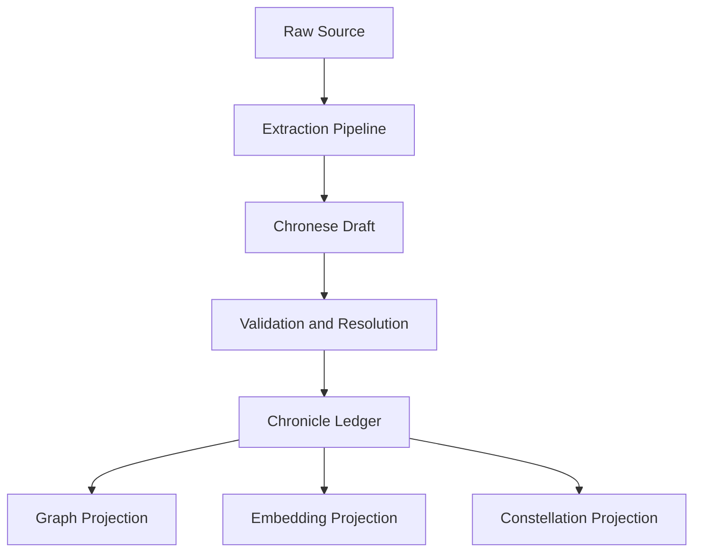

# Chronese

`Chronese` is the proposed canonical semantic language of the Chronik.

It is not a human language.
It is not a replacement for source text.
It is not merely a triple format.

It is a structured, language-neutral, event-centric representation for distilled knowledge.

At full maturity, the Chronik should exist simultaneously in multiple representational layers:

- source-preserving verbatim text
- canonical semantic form
- graph projections
- embedding projections
- agent-facing operational packets

Chronese is the canonical semantic form in that stack.

## Why Chronese Exists

Natural language is rich, subtle, and human-legible.
It is also ambiguous, redundant, and difficult to reason over reliably at scale.

Flat triples are compact and useful.
They are also too narrow for many real-world knowledge structures.

The Chronik needs a middle language that is:

- more precise than prose
- more expressive than naive subject-predicate-object triples
- more stable than ad hoc extraction JSON
- more auditable than pure embeddings
- more language-neutral than English summaries

Chronese exists to be that middle language.

## Design Goals

Chronese should be:

### 1. Language-Neutral

A fact extracted from German, Tibetan, English, or Chinese sources should converge into the same semantic substrate.

### 2. Event-Centric

The world is not made primarily of nouns.
It is made of events, processes, roles, states, and changes over time.

Chronese should therefore center around event-like assertion frames, not just entity pairs.

### 3. Epistemically Explicit

Every semantic unit should carry its epistemic posture:

- observed
- reported
- inferred
- hypothesized
- disputed
- deprecated

It should also carry support and contradiction links.

### 4. Provenance-Bound

Nothing in Chronese should exist without traceability back to a source anchor.

### 5. Projection-Friendly

Chronese is not the only storage form.
It should be easy to project into:

- graph edges
- hyperedges
- vector embeddings
- Constellations
- natural-language summaries

### 6. Versionable

Chronese structures should evolve over time without destroying historical auditability.

## Core Primitive

The deepest primitive in Chronese is not the entity and not the edge.
It is the **assertion frame**.

An assertion frame captures that:

- something happened, existed, was claimed, or was inferred
- at some time
- in some place
- involving some participants or objects
- under some qualifiers
- with some epistemic state
- grounded in one or more sources

## Core Structures

The exact schema should remain flexible, but a mature Chronese system likely needs at least these structures.

### 1. `EntityRef`

Represents a stable referent in the world.

```yaml
entity:
  id: Q806463
  kind: place
  label: Uttarkashi
  aliases:
    - Uttar Kashi
    - Uttarkashi
  external_ids:
    wikidata: Q806463
```

### 2. `AssertionFrame`

Represents an event, state, claim, or relation in context.

```yaml
assertion:
  id: asr_01J0...
  type: event
  event_kind: arrival
  participants:
    - entity: Q78477
      role: traveler
    - entity: AKA_marchese_0001
      role: companion
  location:
    entity: Q806463
  time:
    mode: approximate
    expression: midnight
  qualifiers:
    - key: narrative_context
      value: after_long_wandering
```

### 3. `EpistemicState`

Represents how the Chronik should hold the assertion.

```yaml
epistemic_state:
  status: observed_claim
  confidence: 0.72
  controversy: 0.08
  support_count: 1
  contradiction_count: 0
  derivation_depth: 0
```

### 4. `SourceAnchor`

Grounds the assertion in the source world.

```yaml
source_anchor:
  source_type: gutenberg
  identifier: "Gutenberg:12345"
  location: chapter_03:offset_18433_18601
  language: en
  snippet: >
    After long wandering we reached the temple city of Uttar Kashi around midnight...
```

### 5. `RelationProjection`

Allows Chronese to be projected into graph form when useful.

```yaml
relation_projection:
  source: Q78477
  relation: REACHED
  target: Q806463
  weight: 0.72
  derived_from: asr_01J0...
```

## Example: Historical Narrative

Source sentence:

> After long wandering we reached the temple city of Uttar Kashi around midnight.

Possible Chronese representation:

```yaml
assertion:
  id: asr_arrival_uttarkashi_0001
  type: event
  event_kind: arrival
  participants:
    - entity: Q78477
      role: narrator_traveler
    - entity: AKA_marchese_0001
      role: companion
  location:
    entity: Q806463
    role: destination
  time:
    mode: approximate
    expression: midnight
  qualifiers:
    - key: path_condition
      value: after_long_wandering
  epistemic_state:
    status: observed_claim
    confidence: 0.72
    controversy: 0.04
    derivation_depth: 0
  source_anchor:
    source_type: gutenberg
    identifier: "Gutenberg:SevenYearsInTibet"
    location: chapter_03:offset_18433_18601
    language: en
    snippet: >
      After long wandering we reached the temple city of Uttar Kashi around midnight.
```

## Example: Scientific Claim

Chronese should also be able to represent scientific structure, not only narrative events.

```yaml
assertion:
  id: asr_hypothesis_thermo_0023
  type: claim
  claim_kind: causal_hypothesis
  subject:
    entity: concept_inflammation_marker_x
  predicate: predicts
  object:
    entity: outcome_mortality_risk_y
  qualifiers:
    - key: population
      value: adults_over_65
    - key: study_type
      value: observational
    - key: effect_size
      value: 1.8
  epistemic_state:
    status: reported_claim
    confidence: 0.61
    controversy: 0.33
    derivation_depth: 0
  source_anchor:
    source_type: arxiv
    identifier: "doi:10.xxxx/xxxx"
    location: section_4.2
    language: en
```

## Chronese and the Chronik Stack

Chronese should sit between raw sources and all operational projections.



The key principle:

**Chronese is not the final user-facing form. It is the canonical internal form from which many other forms are derived.**

## Chronese vs RDF / Wikidata / Triples

Chronese should borrow from existing traditions without being trapped by them.

### What Chronese can inherit

- from RDF: graph interoperability
- from Wikidata: identifiers, properties, qualifiers, references
- from event sourcing: immutable append-only semantics
- from provenance models: traceability
- from knowledge graphs: relational navigation

### What Chronese must go beyond

- binary relations as the primary unit
- English-centric labels as canonical meaning
- weak temporal handling
- limited event-role structure
- hidden epistemic posture

Chronese is closer to a typed event-and-claim calculus than to a classical triple store.

## Minimal Realistic Path

Chronese does not need a new parser or a custom language runtime in Generation 1.

The realistic first implementation is:

- a strict JSON/YAML schema
- Pydantic models in Python
- append-only storage in the Chronicle Ledger
- projection adapters into Neo4j and vector stores

Only later, if justified, should Chronese become a more formal language with:

- dedicated schema versioning
- validation tooling
- diff tooling
- optimized binary encoding
- richer compiler logic

## Open Questions

Chronese raises several deep questions that should remain explicit:

1. What is the optimal grain of an assertion frame?
2. When should a relation be projected directly, and when should it remain embedded inside an event frame?
3. How should Chronese encode contradiction and contested interpretations?
4. How much source text should be preserved inline versus by reference?
5. How should private Lethe assertions differ from public Akasha assertions?
6. When does Chronese need hyperedges rather than graph projections?

## Final Thesis

If `VISION.md` is the civilizational bet, and `ARCHITECTURE.md` is the system blueprint, then Chronese is the likely candidate for the Chronik's native semantic tongue.

Not a language for humans to speak.
Not a language for marketing.

A language for distilled, traceable, eventful knowledge.
