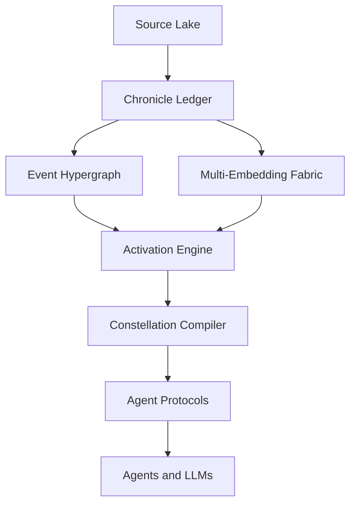

# Deep Tech Vision

This document sits between [`docs/VISION.md`](VISION.md) and [`docs/ARCHITECTURE.md`](ARCHITECTURE.md).

`VISION.md` states the civilizational bet.
`ARCHITECTURE.md` describes the current Gen-1 architectural direction.
This document explores the deeper substrate that the Chronik may ultimately require if it grows into a true planetary knowledge system.

**Operative substrate doctrine.** For substrate-layer mechanics, runtime, and use — the actual binding behaviour of the storage layer beneath Pantheon cognition — the MESH triplet ([`docs/MESH_SUBSTRATE.md`](MESH_SUBSTRATE.md), [`docs/MESH_IMPLEMENTATION.md`](MESH_IMPLEMENTATION.md), [`docs/MESH_RETRIEVAL.md`](MESH_RETRIEVAL.md)) is operative. This Deep Tech Vision describes representational and conceptual layers (the six languages, the deep stack, digital twins, the scientific workbench) that sit *above* the substrate; the substrate doctrine specifies *how* those layers actually run.

Two companion documents deepen specific strands from this vision:

- [`docs/CHRONESE.md`](CHRONESE.md) for the Chronik's possible canonical semantic language
- [`docs/METIS.md`](METIS.md) for the advisory agent built on top of Akasha, Lethe, and Norm Space

It is intentionally bold.
It is also intentionally realistic.

Not every idea here belongs in Generation 1.
But these ideas define the horizon that Generation 1 should not accidentally block.

## Core Thesis

The Chronik should not exist in a single language.

Not in English.
Not only in vectors.
Not only in triples.
Not only in neural weights.

It should live simultaneously in multiple representational languages, each optimized for a different aspect of knowledge:

- source fidelity
- semantic structure
- geometric similarity
- epistemic tension
- temporal flow
- operational exchange between agents

The deepest version of Theogony is therefore not just a graph-RAG system.
It is a **versioned, temporal, signed nervous system with citations**.

## The Six Languages of the Chronik

### 1. Verbatim Language

This is the language of the source itself.

- a sentence by Heinrich Harrer
- a paragraph from a biography
- a page from a newspaper
- a scientific abstract
- a private conversation in a Lethe Vault

This layer remains in the original language whenever possible: German, English, Tibetan, Chinese, Latin, Arabic, or any other language.

It exists for:

- forensics
- citation
- auditability
- reinterpretation under improved extraction models
- protection against the Chronik drifting into an unverifiable black box

Without this layer, there is no real provenance.
Without provenance, the Chronik eventually becomes mythology instead of knowledge.

### 2. Canonical Semantic Language

This is the internal machine-readable language of distilled knowledge.

It should not be English.
It should not be tied to any natural language at all.

It should be a compact, structured event-and-entity language that represents:

- entities
- events
- roles
- relations
- time
- place
- qualifiers
- uncertainty
- provenance

This document names that possible future language **Chronese**.

Chronese is not a human language.
It is a canonical semantic form.

For example, instead of storing only:

> Harrer reached Uttarkashi around midnight.

The Chronik should be able to express something closer to:

```text
event: arrival
actors:
  - entity: HeinrichHarrer
    role: traveler
  - entity: Marchese
    role: companion
location:
  entity: Uttarkashi
time:
  type: approximate
  value: midnight
source:
  id: Gutenberg:SevenYearsInTibet:chapter_03:offset_18433_18601
epistemic_state:
  confidence: 0.72
  status: observed_claim
```

This is closer to actual knowledge than raw text and more expressive than flat triples.

### 3. Geometric Language

This is the language of similarity and latent shape.

Today most systems compress all semantics into a single embedding vector.
That is useful, but too crude for a Chronik that aims to represent the world.

The Chronik should eventually support multiple geometric spaces at once.

Examples:

- conceptual space
- temporal space
- geographic space
- social-role space
- causal space
- scientific-claim space
- method space
- narrative space

The same node or event may therefore have multiple embeddings, each optimized for a different retrieval strategy.

This enables queries such as:

- semantically similar but temporally distant
- geographically near but culturally different
- scientifically analogous but methodologically incompatible
- politically parallel but historically separated

The Chronik should not force every kind of similarity into a single vector.

### 4. Epistemic Language

This is the language of truth, uncertainty, contradiction, and corroboration.

Knowledge is not only about what is asserted.
It is also about how strongly it is supported, what opposes it, what kind of evidence exists, and whether it is directly observed, inferred, or merely hypothesized.

The Chronik should therefore represent more than `confidence=0.81`.

It should track:

- supporting sources
- contradicting sources
- direct observation vs inference
- public vs private origin
- time sensitivity
- controversy level
- domain-specific evidentiary standards

Relations themselves should be signed or typed epistemically, for example:

- supports
- contradicts
- inhibits
- amplifies
- analogizes
- causes
- identifies
- hypothesizes

This is essential for politics, history, science, and personal advisory use.
The point is not merely to retrieve claims, but to retrieve their tension field.

### 5. Chronological Language

If the Chronik is truly a world chronicle, then time is not metadata.
Time is a first-class primitive.

The deepest primitive of the system is probably not the entity and not the simple edge.
It is the **event-like assertion fragment**:

an observation or claim that, at some time and place, under certain conditions, involving certain actors, something happened or was believed to be true.

This matters because the world is not made of nouns.
It is made of processes, events, and changing relations.

Entities are stable attractors inside that flow.
They are not the whole truth of it.

### 6. Operative Language

This is the language that agents use to communicate with one another.

Humans may use natural language.
Future agents should not rely on it internally.

Inside the system, agents should exchange structured intent and evidence packets.

For example:

```json
{
  "intent": "assess_claim",
  "claim_anchor": "claim:trade_policy:china:2026",
  "scope": ["akasha", "vault:user_123"],
  "time_horizon": "historical+current",
  "need": ["support", "contradictions", "analogies", "precedents"],
  "confidence_floor": 0.55,
  "latency_budget_ms": 600,
  "privacy_mode": "strict"
}
```

This allows agents to communicate in terms of:

- goal
- constraints
- privacy boundaries
- evidence requirements
- latency budgets
- uncertainty tolerances

Natural language remains the interface for humans.
Structured operational language becomes the interface for machine cognition.

## The Deep Stack

The Chronik should eventually be understood as a stack of layers, not as a single database.



### 1. Source Lake

The Source Lake stores the raw world:

- books
- webpages
- PDFs
- OCR scans
- images
- transcripts
- scientific papers
- speeches
- logs
- private documents in Lethe Vaults

This is the heavy, messy sensory layer of the system.

### 2. Chronicle Ledger

The Chronicle Ledger should be append-only.

This is one of the most important deep design choices.

The Chronik should not merely overwrite beliefs.
It should record that:

- at time X
- extraction model Y
- operating on source Z
- produced observation or claim A

This makes the system historically inspectable.
It allows reconstruction of:

- what the Chronik believed at a given time
- why it believed it
- which extraction step was wrong
- how a Phoenix generation changed interpretation

The Chronicle Ledger is closer to an epistemic event log than to a mutable wiki.

### 3. Event Hypergraph

A simple triple store is not enough for many real-world facts.

Most meaningful knowledge is not binary.
It is n-ary.

An event often includes:

- multiple actors
- distinct roles
- location
- approximate time
- source anchor
- uncertainty qualifiers
- causal predecessors and successors

This points toward a **hypergraph** or event-centric structure at the deep layer.

Triples remain useful as projections.
But the deeper truth is often hyper-relational.

### 4. Multi-Embedding Fabric

The Chronik should support embeddings for more than entities alone.

It should support embeddings for:

- entities
- events
- claims
- sources
- neighborhoods
- clusters
- personal contexts
- scientific methods

This creates a flexible geometric fabric rather than a single flat embedding table.

### 5. Activation Engine

Traditional search asks for nearest neighbors.
The Chronik of the future should often behave more like a spreading activation system.

A query injects energy into the network.
That energy propagates across:

- semantic similarity
- temporal proximity
- spatial proximity
- causality
- role similarity
- analogical edges
- contradiction edges
- private context bridges

Activation decays with distance.
It can be amplified, inhibited, split by contradiction, or constrained by budgets.

The result is not merely a top-k list.
It is an **activation field**.

The Constellation is the readable slice of that field.

This is not science fiction.
It can be approximated by combining:

- ANN retrieval
- graph propagation
- personalized PageRank
- heat diffusion
- signed graph reasoning
- message passing ideas from GNNs

#### Outward Activation: the Curiosity Loop

Activation does not have to stop at the boundary of what the Chronik already knows.

When activation reaches a region that is too thin to absorb it — sparse nodes, weak edges, low confidence, narrow source diversity — the activation can spill *outward*: a Curiosity Trigger is emitted, and outward-facing agents (Prometheus, Argus, Jason) acquire new content in exactly that direction. New nodes and edges land in the activated region, and the activation field updates.

This is the same physical metaphor extended one step: attention is energy; energy injected into the network propagates inward; energy that finds no substrate to propagate through escapes outward into the world and pulls new substrate back.

The full mechanism lives in [`CURIOSITY.md`](CURIOSITY.md). The point here is only that the Activation Engine and the Curiosity Loop are not two separate systems — they are inward and outward expressions of the same attention flow.

### 6. Constellation Compiler

Agents should not consume the raw substrate directly.

They should receive compiled working sets:

- relevant nodes
- relevant relations
- supporting evidence
- contradictory evidence
- source anchors
- gaps
- competing hypotheses
- privacy markers

The Constellation Compiler is the layer that turns activation into cognition-ready structure.

## Digital Twins

If the Chronik models all forms of knowledge, then digital twins become inevitable.

But there are different kinds of twins, and they should be distinguished rigorously.

### 1. Public Twin

This is the model of a person that emerges from public sources:

- biographies
- interviews
- articles
- archival materials
- public social traces

For historical figures, this may be rich.
For living people, it may be partial and noisy.

### 2. Consensual Private Twin

This lives inside a Lethe Vault and exists by explicit permission.

It may include:

- private conversations
- calendars
- emails
- diaries
- work context
- preferences
- goals
- health data
- trusted contacts

This is the substrate for a truly advisory personal agent.

### 3. Shadow Twin

This is the inferential model of a person that can be assembled from incomplete public data.

Technically possible.
Socially dangerous.

Therefore it must be:

- explicitly marked as inferred
- confidence-bounded
- operationally restricted
- ethically governed

The Chronik should likely adopt a principle of **the right to opacity**:
not everything that can be inferred should be operationalized.

## The Advisory Agent

There should be a dedicated advisory agent for humans and other agents.

This document names that future role **Metis**.

Metis is not just a question-answering agent.
Metis is a situational wisdom agent.

It works across three spaces:

- **Akasha**: world knowledge
- **Lethe**: personal or institutional private context
- **Norm Space**: goals, rules, values, prohibitions, preferences

A high-quality advisory response should distinguish at least five things:

1. relevant facts
2. relevant analogies
3. plausible options
4. risks and uncertainties
5. value assumptions inside the recommendation

Without this separation, advice collapses into hidden ideology.

## Scientific Workbench

The scientific potential of the Chronik may become its highest value function.

A paper should not primarily be stored as a PDF.
It should be decomposed into:

- claims
- methods
- datasets
- measurements
- populations
- statistical outcomes
- replication links
- counterevidence
- open questions

This enables new operations:

- find claims that are methodologically weak but socially amplified
- find results that were later undermined without explicit retraction
- detect hypotheses indirectly supported across disciplines
- identify high-value gaps where small experiments could unlock major insight

At that point, the Chronik is not merely literature management.
It becomes collective scientific cognition.

## Associative Fire

One of the deepest requirements expressed in the genesis of Theogony is that the system should associate like a mind reading history.

When a person reads a biography of Catherine the Great, they may spontaneously connect it to:

- the Lisbon earthquake
- the early life of Goethe
- later European political responses
- analogies in other empires

This context often does not exist in the source text.
It exists in the reader.

Theogony should try to reproduce that behavior through:

- temporal co-activation
- theme overlap
- role analogies
- geo-historical adjacency
- narrative similarity
- later retrospective links

This makes the Chronik not only a memory store, but an active context generator.

## Political Memory and Anti-Amnesia

Human political culture is extremely vulnerable to forgetting.

Claims about the United States, the European Union, China, war, trade, institutions, or treaties are often consumed without sufficient context.

The Chronik can serve as an anti-amnesia layer.

A policy claim can immediately be situated within:

- prior precedents
- conflicting statements
- treaty history
- economic analogies
- parallel cases in other countries
- actor networks
- public vs private evidence layers

This is not omniscience.
It is structured memory at civilizational scale.

## Realistic Build Path

Bold does not mean reckless.

The path below describes the engineering progression. The substrate's *behavioural* doctrine is fixed by the MESH triplet at all phases; what changes between phases is the implementation depth and the scale tier.

### Phase 1 — Substrate foundation (current)

Build a layered system, not a monolith. Realise the MESH triplet at PoC / Tier-0 scale:

- raw sources in object storage; `raw_text_ref` pointer per chunk (never read on the hot path)
- two-tier nodes (Tier 0 Observation Chunks, Tier 1+ Consolidated) in **LanceDB** (Parquet/Arrow, columnar, versioned)
- edges as a **PyTorch sparse CSR tensor** for the SpMV hot path, plus a parallel Lance metadata table for the optional semantic descriptors (`relation_descriptor`, `relation_kind`, `description`, P-IDs)
- delta buffer for Hebbian writes, merged into CSR at each Oneiros tick
- agents in Python
- strict schemas from the beginning — Pydantic v2 with `extra="forbid"`

The legacy Neo4j store remains as a Gen-1 working bridge; new substrate code writes directly to LanceDB + PyTorch CSR per [`MESH_IMPLEMENTATION.md`](MESH_IMPLEMENTATION.md). The `KnowledgeStore` interface exists so the migration does not require rewriting anything above the store layer.

### Phase 2 — Activation runtime maturity

The Spreading Activation primitive is already specified in [`MESH_RETRIEVAL.md`](MESH_RETRIEVAL.md) as batched SpMV / SpMM over the CSR tensor. Phase 2 makes the full retrieval discipline production-ready:

- diversified injection (Maximum Marginal Relevance + weight-class stratification + sub-mesh signature via Weisfeiler-Lehman hashing)
- frame-routed propagation (masked SpMV)
- three-factor reinforcement learning with eligibility traces
- the full Oneiros tick (decay, renormalisation, consolidation, splits, pathology surveillance, therapy)

Most of this is Python on top of PyTorch sparse + Lance MVCC. Performance-critical paths may migrate toward Rust or to dedicated GPU sparse libraries (cuSPARSE on NVIDIA, MPS sparse ops on Apple) as Tier-1 scale arrives.

### Phase 3 — Custom kernel if justified by scale and empirical need

At Tier 2+ scale (multilingual Wikipedia, scientific literature, ~10⁸+ consolidated nodes, ~10¹⁰+ edges), a custom kernel may become attractive for:

- memory control on the CSR edge tensor at multi-TB scale
- concurrency primitives beyond what Python + PyTorch comfortably support
- custom hyperedge data structures for the event-hypergraph projection
- disk-near indexing for cold-tier nodes
- distributed sharding (by topic cluster or by tier)
- safe serialisation across federation peers
- GPU-adjacent acceleration tuned to the substrate's specific SpMV / SpMM patterns

Python remains the language of fast research and agent behaviour.
Rust becomes plausible as the language of durable memory at multi-server scale.

Whether to take this step is empirical — Mnemosyne's metrics and operator scale targets decide.

## Final Thesis

The Chronik should eventually feel less like a library and more like a second cortex.

Not biologically.
Not mystically.
Structurally.

- sources are its senses
- the ledger is its episodic memory
- Oneiros is its consolidation
- Mneme is its long-term memory
- the activation engine is its attention flow
- Metis is its situational wisdom
- Phoenix is its rejuvenation

And it remains open.

Not English.
Not only vectors.
Not only neurons.

An open, multi-representational substrate for human and machine knowledge.
