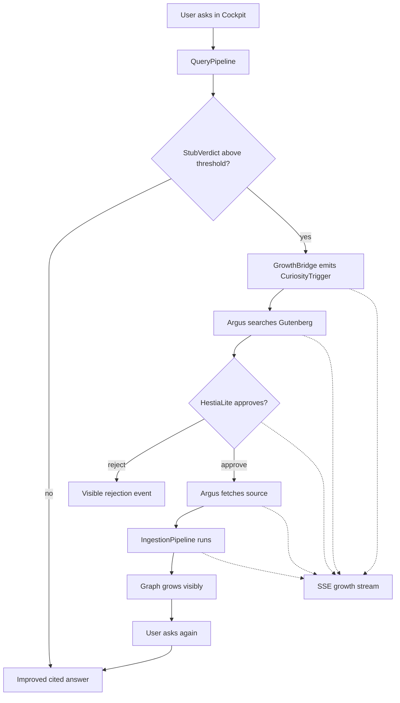
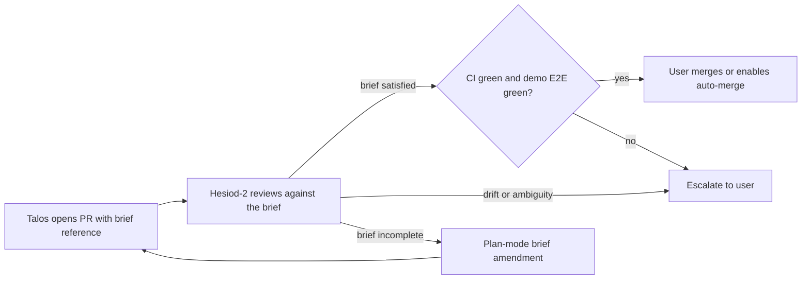

# Living Demo Plan

**Status:** binding execution plan for W7-W9.  
**Purpose:** replace broad roadmap language with a narrow build sequence that produces the first honest living Pantheon demo.  
**Supersedes:** former `docs/plans/AUTONOMOUS_CHRONICLE_GROWTH_ROADMAP.md`.

## Why this plan exists

Generation 1 already proved that Theogony can ingest a source, build a cited vector-graph, and answer questions against it. What it has **not** proved is the load-bearing promise of the project:

> a question exposes a gap, the system acquires the missing source in a controlled way, the graph grows visibly, and the next answer is better because the system actually learned.

That closed loop is now the priority. Until it exists, no further UI polish, side-agents, or growth-theatre counts as meaningful progress.

## The demonstration moment

This is the one recording that decides whether W7-W9 succeeded.

```text
00:00  Cockpit open, chronicle close to empty (only pantheon_self seed).
00:10  User asks: "Who was Sven Hedin and what did he investigate in Tibet?"
00:15  Answer: "I only know a little. Blind spot detected in region
        [Tibet, expedition, early 20th century]. Argus is searching..."
        The growth panel opens.
00:25  Argus: Gutenberg search -> 3 candidates -> #43497 score 0.87 ->
        HestiaLite approved -> fetch starts.
00:55  Pipeline: sentences extracted, entities resolved, relations stored,
        embeddings written.
01:40  The graph grows visibly in the cockpit.
02:00  System: "Done. Ask again."
02:10  User repeats the question.
02:15  Longer cited answer with Hover-Lupe drill-down.
02:50  User clicks "Lhasa" -> zoom opens -> another stub appears ->
        "Younghusband expedition - Argus is searching..."
```

If this recording can be produced honestly on W9, the system has its first living demo. If not, the milestone is not done.

## The closed loop to build



## What stays frozen until the demo works

- No new Wave work beyond W7-W9.
- No new TickPhases under `src/theogony/memory/`.
- No cockpit polish outside the growth panel.
- No new PHX tickets unless they come directly from the demo loop.
- No provider/default-model churn unless the demo path requires it.
- No public launch work (Smithery, Hugging Face, brand/media) before the demo exists.

W1-W6 outputs stay in the repository. They are frozen, not deleted.

## W7-W9 execution plan

### W7-A: CuriosityTrigger + GrowthBridge

**Goal:** turn existing stub signals into a typed, auditable trigger.

**Primary files**
- `src/theogony/curiosity/stub_detector.py`
- `src/theogony/curiosity/trigger.py` (new)
- `src/theogony/curiosity/growth_bridge.py` (new)
- `src/theogony/reporting/models.py`
- `src/theogony/config/settings.py`

**Deliverables**
- `CuriosityTrigger` Pydantic model with:
  - `region_descriptor`
  - `gap_class` as a small fixed literal set
  - `proposed_acquisition_spec`
  - `budget`
  - `audit_id`
- `GrowthBridge` that consumes `StubVerdict` and emits at most one trigger per query.
- `GrowthBridgeSettings` under `Settings.curiosity` with:
  - `enabled: bool = False`
  - `trigger_threshold: float = 0.7`
  - `max_triggers_per_query: int = 1`
- `CuriosityRunReport` added beside the existing run-report family.

**Hard rules**
- Default stays off in ordinary settings.
- The demo path must enable it explicitly, never through hidden local state.
- No background crawling. This stage emits a trigger only.

### W7-B: Argus v0.1 + HestiaLite

**Goal:** let one autonomous agent act on the trigger in a narrow, governed way.

**Primary files**
- `src/theogony/acquisition/gutenberg.py`
- `src/theogony/docs_ingest/pipeline.py`
- `src/theogony/agents/argus.py` (new)
- `src/theogony/agents/hestia_lite.py` (new)

**Deliverables**
- `ArgusAgent.process(trigger)`:
  - searches Gutenberg using the existing acquisition adapter
  - scores candidates against the region descriptor
  - selects one source above threshold
  - hands the candidate to HestiaLite
- `HestiaLiteApproval.review(...)`:
  - deterministic rules only
  - no LLM
  - approval/reject plus explicit reason
- approved sources are handed into the existing ingest pipeline
- every decision is written into `CuriosityRunReport`

**Hard rules**
- Allowlist is hard-coded to `["gutenberg"]` in v1.
- Web acquisition is structurally out of scope.
- Governance is not optional: no source reaches ingest without HestiaLite.

### W8: Live growth stream in the cockpit

**Goal:** make growth visible as it happens.

**Primary files**
- `src/theogony/cockpit/explorer.py`
- `src/theogony/cockpit/router.py`
- `src/theogony/cockpit/sse.py`
- `src/theogony/cockpit/templates/`
- `src/theogony/cockpit/static/`

**Deliverables**
- new SSE endpoint for growth runs
- event phases:
  - `trigger`
  - `search`
  - `candidates`
  - `hestia_review`
  - `fetch`
  - `extract_entities`
  - `extract_relations`
  - `embed`
  - `store`
  - `done`
- new cockpit panel "Growth live"
- panel activated only for the demo path / explicit opt-in

**Hard rules**
- Existing Explorer behaviour stays unchanged for ordinary use.
- The panel is evidence, not decoration. Counts and phase text must be truthful.

### W9: Demo lock, reset script, recording

**Goal:** make the demo reproducible and recordable.

**Primary files**
- `demo/reset_living_growth.sh` (new)
- `demo/living_growth.md` (new)
- `docs/LIVING_DEMO.md` (new)

**Deliverables**
- reset script that wipes Neo4j, reseeds `pantheon_self`, and enables the growth bridge
- exact 3-minute recording script
- operator-facing doc explaining what the demo proves
- one honest recording run by the user with a real LLM key

**Hard rules**
- The reset path must be one command.
- The recording script must be specific enough that another operator could repeat it.

## Auto-mode discipline for Talos

Talos will run in Cursor auto-mode. That means the brief is the guardrail, not a conversation.

- Every brief must lock every knob explicitly: thresholds, defaults, allowlists, caps, file paths, and acceptance criteria.
- No "consider", no "perhaps", no speculative abstraction.
- On real ambiguity Talos must stop, open a blocked draft PR, state the ambiguity, and wait.
- Every acceptance criterion must be machine-runnable: exact commands, expected exit codes, and key expected outputs.
- Mock-only green is not green for the demo path.
- The demo path must produce a non-empty `CuriosityRunReport`.
- Default-off is acceptable for safe ordinary operation, but the demo enablement must be explicit and scripted.
- Diff cap: 600 LOC per PR excluding tests and docs. Larger work must split.
- No extra modules, agent classes, or TickPhases beyond what the brief authorizes.

## Review and merge workflow



## Backlog hygiene during W7-W9

- W1-W6 default-off work is frozen for the demo period, not deleted.
- The following pieces stay explicitly frozen-for-demo:
  - `MorpheusPhase`
  - `DepthBandPhase`
  - `ReclusterPhase`
  - `BlindSpotAggregationPhase`
  - `PheromoneDecayPhase`
  - `MnemosynePhase`
- Broad Gen 2 backlog work remains valid but deferred.
- No backlog clean-up PR happens during W7-W9. If needed, it happens afterward as a small chore-only change.

## Exit criteria

W7-W9 is complete only when all of the following are true:

1. A query can emit a typed curiosity trigger.
2. Argus can autonomously choose a Gutenberg source and route it through HestiaLite.
3. The existing ingest pipeline can be started from that decision path.
4. The cockpit shows the growth process live via SSE.
5. Re-asking in the same region yields a visibly better cited answer.
6. The recording script can be executed honestly without hidden operator steps.

## Next step after this document lands

The next plan-mode round drafts `docs/etappes/W7A_curiosity_trigger_brief.md`.

Talos does **not** start in auto-mode before that W7-A brief exists, is locked, and is explicitly approved.
