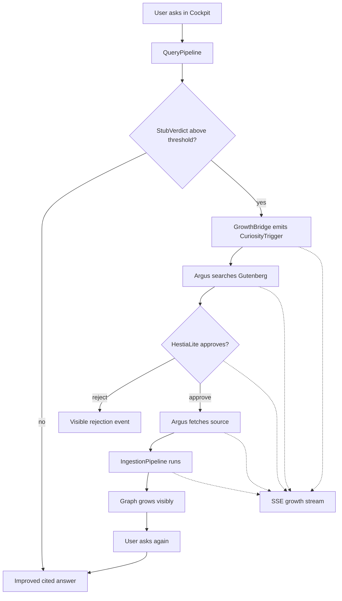
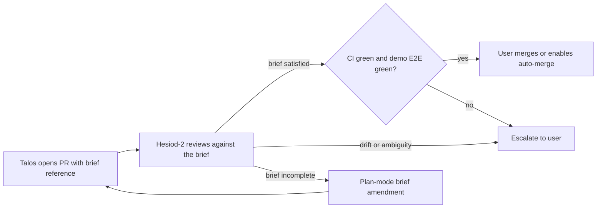
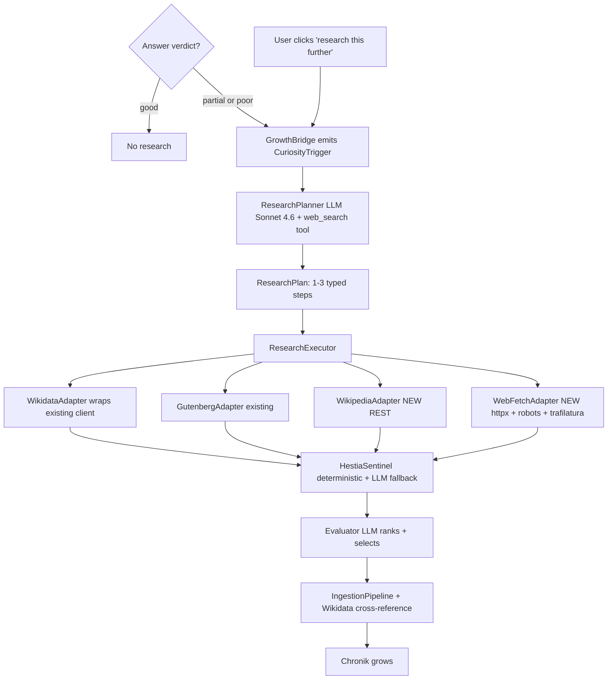
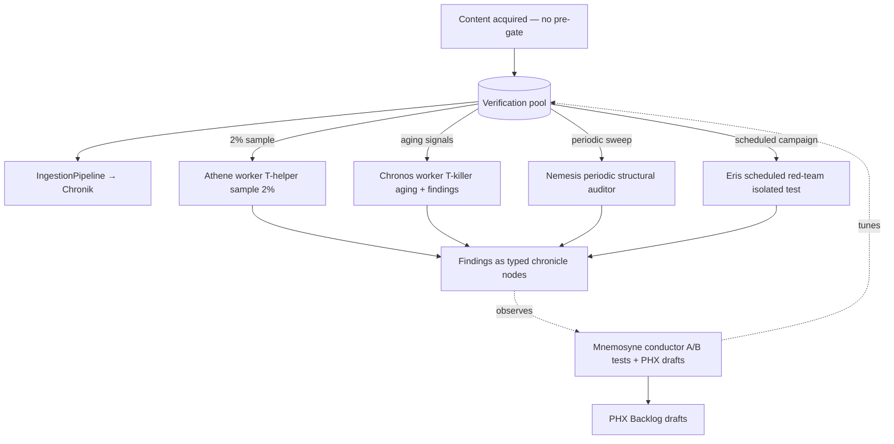

# Living Demo Plan

**Status:** binding execution plan. Wave 1 (W7-W9) shipped; Wave 2 (W10-W12) shipped (W13 rewritten under new doctrine); Wave 3 (W13-W17) in planning.
**Purpose:** replace broad roadmap language with a narrow build sequence that produces the first honest living Pantheon demo.
**Supersedes:** former `docs/plans/AUTONOMOUS_CHRONICLE_GROWTH_ROADMAP.md`.

## Why this plan exists

Generation 1 already proved that Theogony can ingest a source, build a cited vector-graph, and answer questions against it. What it has **not** proved is the load-bearing promise of the project:

> a question exposes a gap, the system acquires the missing source in a controlled way, the graph grows visibly, and the next answer is better because the system actually learned.

That closed loop is now the priority. Until it exists, no further UI polish, side-agents, or growth-theatre counts as meaningful progress.

## The demonstration moment

This is the one recording that decides whether W7-W9 succeeded.

```text
00:00  Cockpit open, chronicle close to empty (only pantheon_self seed).
00:10  User asks: "Who was Sven Hedin and what did he investigate in Tibet?"
00:15  Answer: "I only know a little. Blind spot detected in region
        [Tibet, expedition, early 20th century]. Argus is searching..."
        The growth panel opens.
00:25  Argus: Gutenberg search -> 3 candidates -> #43497 score 0.87 ->
        HestiaLite approved -> fetch starts.
00:55  Pipeline: sentences extracted, entities resolved, relations stored,
        embeddings written.
01:40  The graph grows visibly in the cockpit.
02:00  System: "Done. Ask again."
02:10  User repeats the question.
02:15  Longer cited answer with Hover-Lupe drill-down.
02:50  User clicks "Lhasa" -> zoom opens -> another stub appears ->
        "Younghusband expedition - Argus is searching..."
```

If this recording can be produced honestly on W9, the system has its first living demo. If not, the milestone is not done.

## The closed loop to build



## What stays frozen until the demo works

- No new Wave work beyond W7-W9.
- No new TickPhases under `src/theogony/memory/`.
- No cockpit polish outside the growth panel.
- No new PHX tickets unless they come directly from the demo loop.
- No provider/default-model churn unless the demo path requires it.
- No public launch work (Smithery, Hugging Face, brand/media) before the demo exists.

W1-W6 outputs stay in the repository. They are frozen, not deleted.

## W7-W9 execution plan

### W7-A: CuriosityTrigger + GrowthBridge

**Goal:** turn existing stub signals into a typed, auditable trigger.

**Primary files**
- `src/theogony/curiosity/stub_detector.py`
- `src/theogony/curiosity/trigger.py` (new)
- `src/theogony/curiosity/growth_bridge.py` (new)
- `src/theogony/reporting/models.py`
- `src/theogony/config/settings.py`

**Deliverables**
- `CuriosityTrigger` Pydantic model with:
  - `region_descriptor`
  - `gap_class` as a small fixed literal set
  - `proposed_acquisition_spec`
  - `budget`
  - `audit_id`
- `GrowthBridge` that consumes `StubVerdict` and emits at most one trigger per query.
- `GrowthBridgeSettings` under `Settings.curiosity` with:
  - `enabled: bool = False`
  - `trigger_threshold: float = 0.7`
  - `max_triggers_per_query: int = 1`
- `CuriosityRunReport` added beside the existing run-report family.

**Hard rules**
- Default stays off in ordinary settings.
- The demo path must enable it explicitly, never through hidden local state.
- No background crawling. This stage emits a trigger only.

### W7-B: Argus v0.1 + HestiaLite

**Goal:** let one autonomous agent act on the trigger in a narrow, governed way.

**Primary files**
- `src/theogony/acquisition/gutenberg.py`
- `src/theogony/docs_ingest/pipeline.py`
- `src/theogony/agents/argus.py` (new)
- `src/theogony/agents/hestia_lite.py` (new)

**Deliverables**
- `ArgusAgent.process(trigger)`:
  - searches Gutenberg using the existing acquisition adapter
  - scores candidates against the region descriptor
  - selects one source above threshold
  - hands the candidate to HestiaLite
- `HestiaLiteApproval.review(...)`:
  - deterministic rules only
  - no LLM
  - approval/reject plus explicit reason
- approved sources are handed into the existing ingest pipeline
- every decision is written into `CuriosityRunReport`

**Hard rules**
- Allowlist is hard-coded to `["gutenberg"]` in v1.
- Web acquisition is structurally out of scope.
- Governance is not optional: no source reaches ingest without HestiaLite.

### W8: Live growth stream in the cockpit

**Goal:** make growth visible as it happens.

**Primary files**
- `src/theogony/cockpit/explorer.py`
- `src/theogony/cockpit/router.py`
- `src/theogony/cockpit/sse.py`
- `src/theogony/cockpit/templates/`
- `src/theogony/cockpit/static/`

**Deliverables**
- new SSE endpoint for growth runs
- event phases:
  - `trigger`
  - `search`
  - `candidates`
  - `hestia_review`
  - `fetch`
  - `extract_entities`
  - `extract_relations`
  - `embed`
  - `store`
  - `done`
- new cockpit panel "Growth live"
- panel activated only for the demo path / explicit opt-in

**Hard rules**
- Existing Explorer behaviour stays unchanged for ordinary use.
- The panel is evidence, not decoration. Counts and phase text must be truthful.

### W9: Demo lock, reset script, recording

**Goal:** make the demo reproducible and recordable.

**Primary files**
- `demo/reset_living_growth.sh` (new)
- `demo/living_growth.md` (new)
- `docs/LIVING_DEMO.md` (new)

**Deliverables**
- reset script that wipes Neo4j, reseeds `pantheon_self`, and enables the growth bridge
- exact 3-minute recording script
- operator-facing doc explaining what the demo proves
- one honest recording run by the user with a real LLM key

**Hard rules**
- The reset path must be one command.
- The recording script must be specific enough that another operator could repeat it.

## Auto-mode discipline for Talos

Talos will run in Cursor auto-mode. That means the brief is the guardrail, not a conversation.

- Every brief must lock every knob explicitly: thresholds, defaults, allowlists, caps, file paths, and acceptance criteria.
- No "consider", no "perhaps", no speculative abstraction.
- On real ambiguity Talos must stop, open a blocked draft PR, state the ambiguity, and wait.
- Every acceptance criterion must be machine-runnable: exact commands, expected exit codes, and key expected outputs.
- Mock-only green is not green for the demo path.
- The demo path must produce a non-empty `CuriosityRunReport`.
- Default-off is acceptable for safe ordinary operation, but the demo enablement must be explicit and scripted.
- Diff cap: 600 LOC per PR excluding tests and docs. Larger work must split.
- No extra modules, agent classes, or TickPhases beyond what the brief authorizes.

## Review and merge workflow



## Backlog hygiene during W7-W9

- W1-W6 default-off work is frozen for the demo period, not deleted.
- The following pieces stay explicitly frozen-for-demo:
  - `MorpheusPhase`
  - `DepthBandPhase`
  - `ReclusterPhase`
  - `BlindSpotAggregationPhase`
  - `PheromoneDecayPhase`
  - `MnemosynePhase`
- Broad Gen 2 backlog work remains valid but deferred.
- No backlog clean-up PR happens during W7-W9. If needed, it happens afterward as a small chore-only change.

## Exit criteria

W7-W9 is complete only when all of the following are true:

1. A query can emit a typed curiosity trigger.
2. Argus can autonomously choose a Gutenberg source and route it through HestiaLite.
3. The existing ingest pipeline can be started from that decision path.
4. The cockpit shows the growth process live via SSE.
5. Re-asking in the same region yields a visibly better cited answer.
6. The recording script can be executed honestly without hidden operator steps.

## Wave 1 — what shipped, what it lacked

W7-A through W9 all merged on `main` (PRs #89, #90, #91, #92). The closed loop technically works: a query that triggers can drive Argus through Hestia into the existing ingest pipeline, with phases visible in the cockpit. The demo recording can be rehearsed end-to-end without manual intervention.

Honest postmortem of what Wave 1 still does not deliver:

- **Trigger fires on the wrong signal.** The W7-A bridge gates on `stub_signal_strength` (constellation thinness). In practice it fires even when the answer was strong — observed live as `verdict=good, nodes=10, edges=9, cited=7` followed by a Gutenberg search that returned zero. The trigger should respond to whether the answer actually held, not to graph topology.
- **Argus is single-source lookup, not research.** The W7-B brief locked Argus to `source_type="gutenberg"`, with the user query passed verbatim as a Gutendex search string. Natural-language queries like "What does Daedalus do?" have no business being passed to a 19th-century-book catalogue, and the result is "0 candidates" theatre. This is the dominant failure of the Wave 1 demo.
- **Hestia is a whitelist gatekeeper, not a per-candidate auditor.** The W7-B HestiaLite blocks unknown source types instead of evaluating individual sources for individual safety questions. That contradicts the Pantheon vision of governed-but-permissive autonomy.
- **The SSE vocabulary makes lookup look like failure.** "search → 0 candidates → done" reads as "the system tried and gave up", not as "the system researched the question and concluded no Gutenberg book matched". Phase names matter for the demo.

Wave 2 fixes those four problems in the smallest cohesive shape that still yields a recording you would actually publish.

---

## Wave 2 — locked decisions

User approval recorded in the Hesiod-2 design conversation of 2026-04-24:

1. **Trigger semantics.** The bridge fires only when the synthesized answer's verdict is `partial` or `poor`, OR when the user explicitly clicks "research this further" in the cockpit. No automatic research on `verdict=good`.
2. **Research planning is LLM-driven.** A small Anthropic call per trigger decomposes (origin_query, gap_summary) into 1-3 typed `ResearchStep`s. Cap: one planner call + one evaluator call per trigger. Budget: ~0.005 EUR per trigger.
3. **No source allowlist.** Web search is enabled. Argus may use any source type. Wikidata identifiers are cross-referenced wherever possible (the existing `extraction/wikidata_client.py` infrastructure already supports this). HestiaLite is replaced by `HestiaSentinel`, which audits per-candidate (URL, content, claim profile) using deterministic defensive rules first and a small Sonnet 4.6 fallback for the unsure cases (~10% of candidates).
4. **Web search uses the LLM provider's native web_search tool**, not a separate Brave / DuckDuckGo adapter. Anthropic Sonnet 4.6 ships a `web_search` server tool; the planner uses it directly. We remain provider-portable but skip a second vendor relationship.
5. **Web fetch uses `httpx` + `trafilatura`** for robots-aware retrieval and clean main-content extraction. New repo dependency, the right one.

---

## Wave 2 — closed loop architecture



---

## Wave 2 — execution plan (W10-W13)

| Sprint | Focus | New brief | Approx LOC |
|---|---|---|---|
| **W10** | Trigger-semantics fix (verdict-based + manual cockpit button), `ResearchPlan` schema, deprecate the W7-A constellation-thinness gate. | `docs/etappes/W10_research_trigger_semantics_brief.md` | ~300 |
| **W11** | `ResearchPlanner` (LLM with `web_search` tool), `Evaluator` (LLM ranker), `WikidataAdapter` thin wrapper. | `docs/etappes/W11_research_planner_brief.md` | ~500 |
| **W12** | `WikipediaAdapter`, `WebFetchAdapter` (httpx + robots + trafilatura), `HestiaSentinel` replaces HestiaLite. | `docs/etappes/W12_web_fetch_hestia_sentinel_brief.md` | ~600 |
| **W13** | New SSE vocabulary, cockpit panel rework, new 3-minute recording. | `docs/etappes/W13_research_demo_relock_brief.md` | ~300 + docs |

---

## Stop list (Wave 2)

The Wave 1 stop list above stays in force. Add for Wave 2:

- No new LLM provider. Sonnet 4.6 only. (Settings remain provider-agnostic; default is fixed.)
- No new web-search vendor. Tool-use only.
- No HestiaLite extension; W12 replaces it cleanly.
- No new Pantheon agents besides what is named in the brief table. Prometheus/Jason/Athene stay mythology until Wave 3 at the earliest.
- No backlog clean-up PR during W10-W13. After W13 only.

---

## What W7-W9 code stays in place vs gets refactored

- `src/theogony/curiosity/trigger.py` — schema **extended** (a `ResearchPlan` field is added in W10); existing fields stay.
- `src/theogony/curiosity/growth_bridge.py` — gate **rewritten** in W10 (verdict instead of stub_signal_strength); module stays.
- `src/theogony/agents/argus.py` — **refactored** in W11; stops being a Gutenberg-only single-step lookup, becomes the executor of a `ResearchPlan` over a pluggable `AcquisitionAdapter` set.
- `src/theogony/agents/hestia_lite.py` — **deleted** in W12, replaced by `src/theogony/agents/hestia_sentinel.py`.
- `src/theogony/curiosity/argus_wiring.py`, `dispatcher.py`, `runner.py` — adjusted to the new entry point.
- `src/theogony/cockpit/growth_stream.py` — **vocabulary updated** in W13.

The branch / PR pattern remains identical to Wave 1: each sprint a separate branch off latest `main`, ending with a PR Hesiod-2 reviews against the brief.

---

## Wave 2 — postmortem (closed 2026-04-24)

W10, W11, W12 all shipped and merged (PRs #94, #95, #96). The research loop is real: verdict-based trigger → LLM ResearchPlanner with Anthropic web_search tool → multi-source ResearchExecutor (Wikidata, Wikipedia, Gutenberg, generic web fetch via httpx + trafilatura) → LLM Evaluator → HestiaSentinel per-candidate auditor → ingest → Chronik grows.

**Honest postmortem of what Wave 2 still baked in wrong:**

The original W13 brief (see `docs/etappes/W13_research_demo_relock_brief.md`) was drafted under the clinic doctrine. It retained HestiaSentinel as a synchronous content judge before ingest and designed the cockpit vocabulary around the HestiaLite-shaped review metaphor (`hestia_review` event type). Both are now rejected by the immune-system doctrine (see `docs/IMMUNE_SYSTEM.md`).

- **HestiaLite and HestiaSentinel are deprecated.** Both are synchronous pre-gate content filters. W13 removes them.
- **Hestia's correct role is post-hoc**, not pre-gate. Her full role (PHX-0039) remains valid as a drift monitor and escalation receiver — that is a Wave 3+ concern, not a W13 cleanup.
- **The SSE vocabulary retains one wrong event type.** `hestia_review` in the W13 brief implies a synchronous approve/reject gate visible to the user. Under the immune system doctrine, content flows into a verification pool and cells observe asynchronously. The corrected W13 renames this event and the overall cockpit vocabulary accordingly.
- **Demo recording is deferred to Wave 3.** The Wave 2 demo recording script in the W13 brief still shows the clinic flow (HestiaSentinel approved → ingested). The real demo recording waits until Wave 3 has the verification-pool concept visible in the cockpit.

The corrected W13 brief (rewritten in this PR) implements the doctrine-clean shape.

---

## Wave 3 — doctrine and execution plan

**Governing doctrine:** [`docs/IMMUNE_SYSTEM.md`](../IMMUNE_SYSTEM.md) (cell types, verification pool, 98% sampling, Findings as first-class data, self-improvement loop).
**Long-horizon doctrine:** [`docs/SELF_MODIFICATION.md`](../SELF_MODIFICATION.md) (Pantheon eventually writes its own next version).

Wave 3 builds the immune system. It is the first wave that is genuinely "alive" in the sense the project has always promised: content flows in without a gate, a background organism samples, marks, recycles, and learns.

### Wave 3 sprint table

| Sprint | Label | Focus | New brief |
|---|---|---|---|
| **W13** | Pre-gate removal | Remove HestiaLite + HestiaSentinel. Route ingest directly into a typed verification pool. Update cockpit vocabulary (`acquired_into_pool` replaces `hestia_review`). Update demo scripts to reflect the open-flow posture. | `docs/etappes/W13_pre_gate_removal_brief.md` (this PR rewrites the brief) |
| **W14** | Athene v0.1 — T-helper | Verification pool as a queryable sampling reservoir. Athene worker pulls ~2% of pool entries, runs structural ingest-report checks, writes `Finding` nodes into the chronicle. | `docs/etappes/W14_athene_brief.md` |
| **W15** | Chronos v0.1 — T-killer | Consumes Athene Findings from the verification pool, clears pool entries, writes targeted `CONTRADICTS` edges only where semantics warrant, and demotes target confidence. No hard deletes and no `SUPERSEDED_BY` in v0.1. | `docs/etappes/W15_chronos_brief.md` |
| **W16** | Nemesis + Eris | Nemesis v0.1 writes read-only structural Findings (confidence-inflation proxy, persistent contradictions, pheromone autobahns). Eris v0.1 adds a fixture-mode red-team harness and campaign Findings. No live adversarial ingest or LLM probes yet. | `docs/etappes/W16_nemesis_eris_brief.md` |
| **W17** | Mnemosyne as conductor | Self-improvement conductor v0.2: collects immune-system metrics, defines success metrics (LLM-capable, fixture-backed for CI), writes `MnemosyneExperiment` proposal nodes, writes PHX draft JSON under run reports, and adds the local Wave 3 test runbook. No code self-modification, settings auto-apply, or live A/B traffic splitting in W17. | `docs/etappes/W17_mnemosyne_conductor_brief.md` |

**After W17:** run the larger local Wave 3 test round from `demo/wave3_local_test.md` (added by the W17 brief). This test is meant to prove that the open ingest path, verification pool, Athene, Chronos, Nemesis, Eris, and Mnemosyne conductor can be observed together in one local loop. It is not meant to prove factual truth, live adversarial robustness, scheduler behaviour, or self-modifying code.

**Wave 3 → Wave 4:** The first Phoenix incarnation is manually curated by humans. Wave 4 work begins when Mnemosyne's accumulated PHX-Backlog drafts and the human review corpus are sufficient to define a real generation transition. The long-horizon principle of self-modification (Pantheon writing its own PRs) lives in Wave 4+.

### Wave 3 closed-loop architecture



### Wave 3 stop list

- No extension of HestiaLite or HestiaSentinel in any form. Both are structurally removed in W13.
- No new synchronous pre-gate content filter for any reason. Operative self-defense (rate limits, robots.txt, size caps, HTTPS enforcement) is the only gate. If a brief asks for a pre-gate — the brief is wrong; stop and escalate to Hesiod.
- No new LLM provider beyond what Wave 2 established. Anthropic Sonnet 4.6 remains the default.
- No demo recording until Wave 3 has a visible verification pool in the cockpit (earliest W14, realistically W15).
- One brief per Talos pickup. Wave 3 briefs are written one at a time, each immediately before the sprint, not batched. Lesson from Wave 2.
- Diff cap remains 600 LOC per PR excluding tests and docs. Cell-class workers are small by design; if a brief asks for more, it needs splitting.

---

## Auto-mode discipline for Talos (Wave 3 addendum)

The Wave 2 discipline above stays in force. One additional rule:

**The immune-system architecture is asynchronous and parallel by definition.** Any brief or implementation that serialises cell-class workers against the ingest path has violated the doctrine. Talos must STOP and escalate to Hesiod if a brief asks him to await a cell-class worker result before completing an ingest operation.
